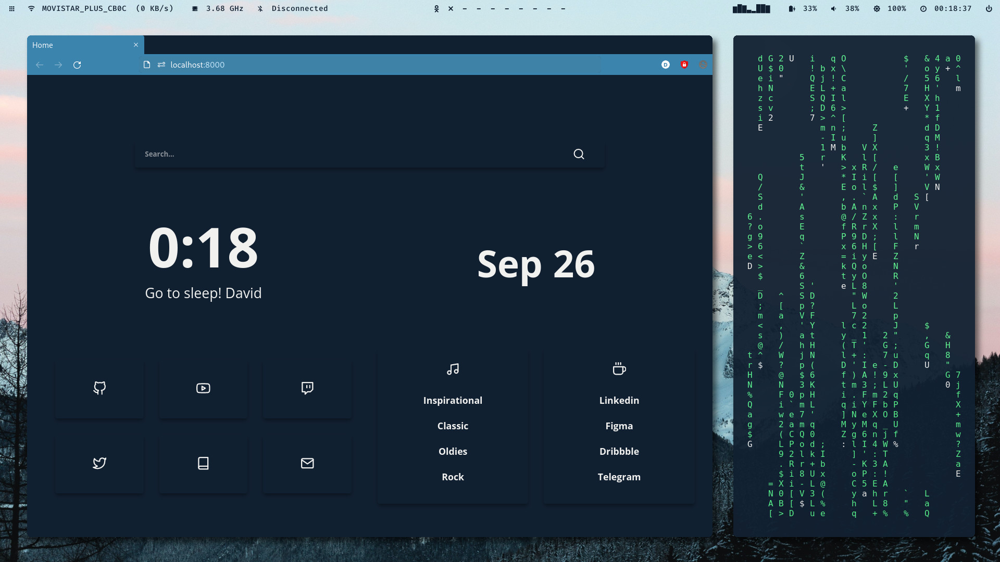
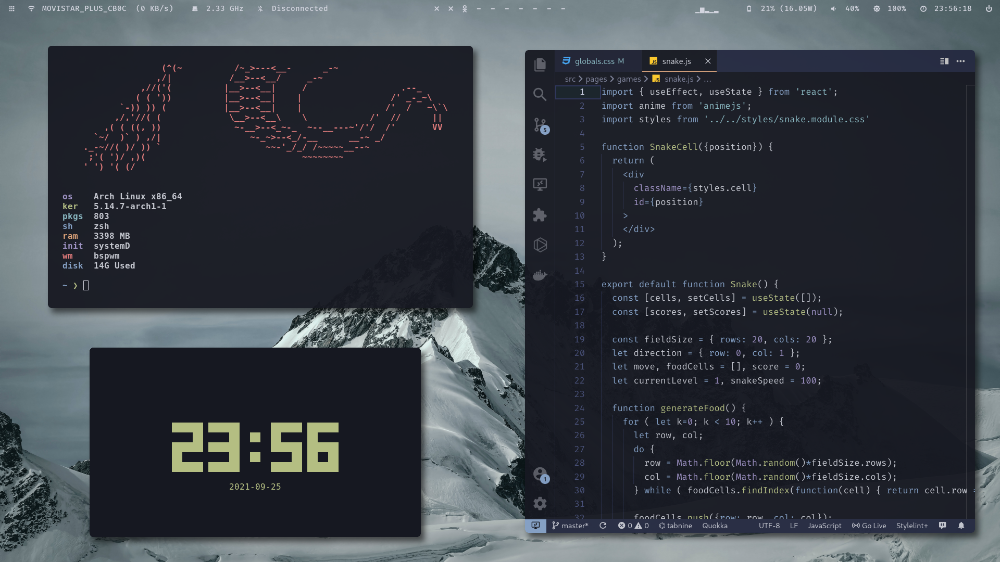
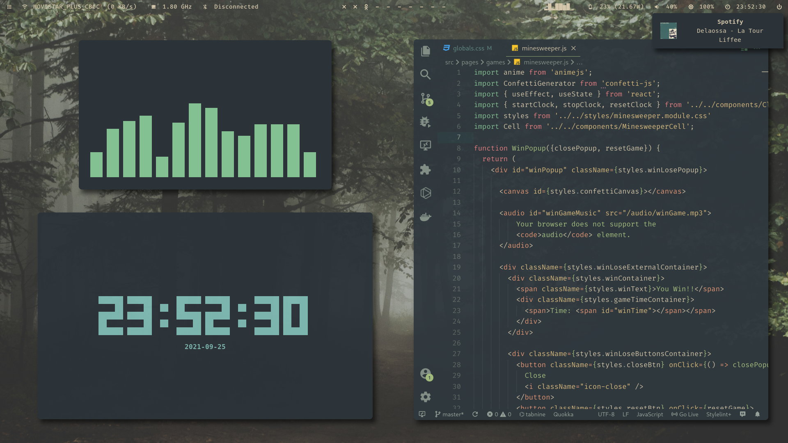

<div align="center"> <h1><strong>SIMPLE</strong></h1> </div>

<details open>
<summary><strong>&nbsp;O V E R V I E W &nbsp;👁️‍🗨️</strong></summary>

Focused on **productivity**, this desktop has all you need in a little bar at the top, leaving a **lot
of free space** for applications. 
</details>

# 

<details open>
<summary><strong>&nbsp;S C R E E N S H O T S &nbsp;📸</strong></summary>

* **Snazzy Theme**

	

* **Iceberg-Dark Theme**

	

* **Everforest-Dark-Hard Theme**

	

* **BlackAndWhite-Light Theme**

	
</details>

#

<details open>
<summary><strong>&nbsp;I N S T A L L A T I O N &nbsp;🛠</strong></summary>
<br>

**Note**: To ensure that all java applications are working well under bspwm,
add to your shell config file (`.bashrc`, `.zshrc`, ...)
```console
export _JAVA_AWT_WM_NONREPARENTING=1
``` 

### Arch Linux
* **Mandatory** dependencies:
	```console
	sudo pacman -S bspwm sxhkd rofi polybar dunst pulseaudio feh brightnessctl playerctl flameshot bc bluez bluez-utils
	```
	(You can use any other AUR helper)
	
	```console
	yay -S cava picom-ibhagwan-git
	```

* **Optional** dependencies:
	```console
	sudo pacman -S alacritty firefox neofetch bottom kitty discord
	```

	```console
	yay -S betterdiscord-installer spicetify-cli spotify
	```

	**Note:** Some of these optional programs may need some configuration in order to work properly with provided patterns.

### Ubuntu
* **Mandatory** dependencies:

	```console
	sudo apt install bspwm sxhkd rofi dunst pulseaudio feh brightnessctl playerctl tint2 flameshot
	```
	* **Dunst**

		In order to replace volume notifications dunstify is also required. To install it just run:
		```console
		git clone https://github.com/dunst-project/dunst.git dunst
		cd dunst
		make dunstify
		sudo mv dunstify /usr/bin
		```

	* **Brightnessctl**

		Even though this dependency can be installed normally with apt, the brightness can't be changed without root privileges.  
		To be able to tweak the brightness normally you need to execute the following command and reboot your computer:
		```console
		sudo usermod -aG video ${USER}
		```

	* **Picom**

		Dependencies:
		```console
		sudo apt install libxext-dev libxcb1-dev libxcb-damage0-dev libxcb-xfixes0-dev libxcb-shape0-dev libxcb-render-util0-dev libxcb-render0-dev libxcb-randr0-dev libxcb-composite0-dev libxcb-image0-dev libxcb-present-dev libxcb-xinerama0-dev libxcb-glx0-dev libpixman-1-dev libdbus-1-dev libconfig-dev libgl1-mesa-dev libpcre2-dev libpcre3-dev libevdev-dev uthash-dev libev-dev libx11-xcb-dev meson
		```

		Installation:
		```console
		git clone git@github.com:ibhagwan/picom.git picom
		cd picom
		meson --buildtype=release . build
		sudo ninja -C build install
		``` 

		For more info see: https://github.com/yshui/picom

	* **Cava**
		* **Ubuntu 20.10 or newer**: 
		
			Cava is available in official repositories. To install it just run:
			```console
			sudo apt install cava
			```

		* **Ubuntu 20.04 or older**:

			Dependencies:
			```console
			sudo apt install libiniparser-dev libfftw3-dev libasound2-dev libncursesw5-dev libpulse-dev libtool automake libiniparser-dev libsdl2-2.0-0 libsdl2-dev
			```

			Installation:
			```console
			git clone git@github.com:karlstav/cava.git cava
			cd cava
			./autogen.sh
			./configure --prefix=/usr
			sudo make install
			```

			For more info see: https://github.com/karlstav/cava#from-source

	* **Polybar**
		* **Ubuntu 20.10 or newer**:

			Polybar is available in official repositories. To install it just run:
			```console
			sudo apt install polybar
			```

		* **Ubuntu 20.04 or older**:
		
			Clone the latest tagged release from [this repository](https://github.com/polybar/polybar).  
			
			Then, install the following packages:
			```console
			sudo apt install -s python3-packaging libuv1-dev libxcb1-dev libxcb-util0-dev libxcb-randr0-dev libxcb-composite0-dev python3-xcbgen xcb-proto libxcb-ewmh-dev libxcb-image0-dev libxcb-icccm4-dev libuv1-dev libcairo2-dev python3-sphinx libfontconfig1-dev libfreetype6-dev libnl-genl wireless-tools libnl-genl-3-dev libiw-dev curl libcurl libcurl4-openssl-dev libmpdclient-dev
			```

			<span style="color:red">**Please note**</span> that the command above may fail to install some dependencies.  
			That is because some libraries, like ``libfreetype6-dev``, depend on specific versions of other libraries.  
			For instance, you may need to downgrade these packages to a different version (whichever version is listed when it fails) with the following command:
			```console
			sudo apt install libfreetype6=2.10.1-2 
			sudo apt install libcurl4=7.68.0-1ubuntu2
			```
			Before installing these
			```console
			sudo apt install libfreetype6-dev libcairo2-dev libcurl4-openssl-dev
			```
			**Note:** *The versions listed in the commands are the ones that worked at the time of writing this, they may vary over time.*
			
			After fixing the broken dependencies you **might want to re-run the first command** to ensure that all the dependencies were installed.

			Then, just cd into the ``polybar`` directory and run:
			```console
			./build.sh
			make -j$(nproc)
			cd build
			sudo make install
			```

			Refer to the [**Polybar wiki, compiling section**](https://github.com/polybar/polybar/wiki/Compiling) for a detailed dependencies and installation guide.


* **Optional** dependencies:
	```console
	sudo apt-get install bottom alacritty neofetch
	```

	* ### Better-discord
		Refer to [this repo](https://gist.github.com/ObserverOfTime/d7e60eb9aa7fe837545c8cb77cf31172#install-betterdiscordctl).  
		Untested.

	* ### Spicetify
		Refer to [this guide](https://spicetify.app/docs/getting-started/simple-installation).  
		Untested.
</details>

#

<details>
<summary><strong>&nbsp;D E T A I L S &nbsp;📝</strong></summary>

| Attribute                | Using                  |
| -------------------------| -----------------------|
| WM                       | bspwm                  |
| Terminal                 | alacritty              |
| Shell                    | zsh                    |
| Editor                   | vscode                 |
| Compositor               | picom                  |
| Notifications            | dunst                  |
| Launcher                 | rofi                   |
| Bar                      | polybar                |
| Font                     | DejaVu Sans Mono       |
| Default theme            | Snazzy                 |
</details>

#

<details>
<summary><strong>&nbsp;M A I N &nbsp; K E Y B I N D S &nbsp;#️⃣</strong></summary>

| Keybind                                 | Action                                                    |
|-----------------------------------------|-----------------------------------------------------------|
| <kbd>super + enter</kbd>                | Spawn terminal                                            |
| <kbd>super + ctrl + f</kbd>             | Spawn web browser                                         |
| <kbd>super + d</kbd>                    | Launch applications launcher                              |
| <kbd>super + w</kbd>                    | Close window                                              |
| <kbd>super + {0-9}</kbd>                | Change workspace                                          |
| <kbd>super + ]</kbd>                    | Change to next workspace                                  |
| <kbd>super + [</kbd>                    | Change to previous workspace                              |
| <kbd>super + shift + {0-9}</kbd>        | Move focused window to workspace                          |
| <kbd>super + s</kbd>                    | Set floating layout                                       |
| <kbd>super + t</kbd>                    | Set tiling layout                                         |
| <kbd>alt + esc</kbd>                    | Launch powermenu                                          |
| <kbd>super + ctrl + c</kbd>             | Launch calculator                                         |
</details>

#

<details>
<summary><strong>&nbsp;D E P E N D E N C Y &nbsp;L I S T &nbsp;🔗</strong></summary>

* [rofi-calc](https://github.com/svenstaro/rofi-calc)
* [bspwm](https://github.com/baskerville/bspwm)
* [sxhkd](https://github.com/baskerville/sxhkd)
* [picom (ibhagwan fork)](https://github.com/ibhagwan/picom)
* [rofi](https://github.com/davatorium/rofi)
* [dunst](https://github.com/dunst-project/dunst)
* [pulseaudio](https://wiki.archlinux.org/title/PulseAudio)
* [feh](https://github.com/derf/feh)
* [brightnessctl](https://github.com/Hummer12007/brightnessctl)
* [playerctl](https://github.com/altdesktop/playerctl)
* [polybar](https://github.com/polybar/polybar)
* [cava](https://github.com/karlstav/cava)
* [flameshot](https://github.com/flameshot-org/flameshot)
* [firefox (Optional)](https://www.mozilla.org/en-US/firefox/new/)
* [alacritty (Optional)](https://github.com/alacritty/alacritty)
* [better-discord (Optional)](https://betterdiscord.app/)
* [spicetify (Optional)](https://spicetify.app/)
* [bottom (Optional)](https://github.com/ClementTsang/bottom)
* [cmus (Optional)](https://github.com/cmus/cmus)
* [neofetch (Optional)](https://github.com/dylanaraps/neofetch)
</details>

#

<details>
<summary><strong>&nbsp;C R E D I T S &nbsp;👥</strong></summary>

* Desktop ported by [@daavidrgz](https://github.com/daavidrgz) and [@LucaDangeloS](https://github.com/LucaDangeloS)
* Original author [@daavidrgz](https://github.com/daavidrgz)
</details>
