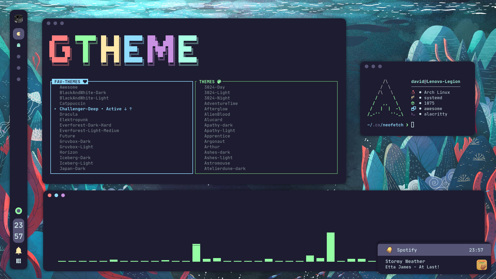
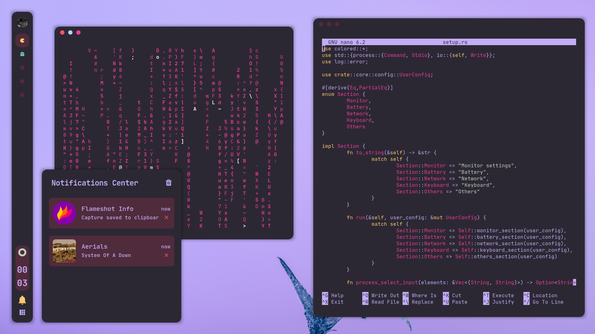

<div align="center"> <h1><strong>NIGHT</strong></h1> </div>

<details open>
<summary><strong>&nbsp;O V E R V I E W &nbsp;👁️‍🗨️</strong></summary>

A **full animated** desktop in awesomeWM, paired with pretty designed widgets.
</details>

# 

<details open>
<summary><strong>&nbsp;S C R E E N S H O T S &nbsp;📸</strong></summary>

* **Night Theme**

	

* **Challenger-Deep Theme**

	

* **Roseate Theme**

	
</details>

#

<details>
<summary><strong>&nbsp;D E T A I L S &nbsp;📝</strong></summary>

* To get your avatar into the bar, you should have an image under ```$HOME/``` called ```.face.icon```

| Attribute                | Using                  |
| -------------------------| -----------------------|
| WM                       | bspwm                  |
| Terminal                 | alacritty              |
| Shell                    | zsh                    |
| Editor                   | vscode                 |
| Compositor               | picom                  |
| Notifications            | dunst                  |
| Launcher                 | rofi                   |
| Bar                      | tint2                  |
| Volume/Brightness        | xob                    |
| Font                     | Caskaydia Cove         |
| Default theme            | Tomorrow-Night-Blue    |
</details>

#

<details>
<summary><strong>&nbsp;M A I N &nbsp; K E Y B I N D S &nbsp;#️⃣</strong></summary>

| Keybind                                 | Action                                                    |
|-----------------------------------------|-----------------------------------------------------------|
| <kbd>super + enter</kbd>                | Spawn terminal                                            |
| <kbd>super + ctrl + f</kbd>             | Spawn web browser                                         |
| <kbd>super + d</kbd>                    | Launch applications launcher                              |
| <kbd>super + w</kbd>                    | Close window                                              |
| <kbd>super + {0-9}</kbd>                | Change workspace                                          |
| <kbd>super + ]</kbd>                    | Change to next workspace                                  |
| <kbd>super + [</kbd>                    | Change to previous workspace                              |
| <kbd>super + shift + {0-9}</kbd>        | Move focused window to workspace                          |
| <kbd>super + s</kbd>                    | Set floating layout                                       |
| <kbd>super + t</kbd>                    | Set tiling layout                                         |
| <kbd>alt + esc</kbd>                    | Launch powermenu                                          |
</details>

#

<details>
<summary><strong>&nbsp;D E P E N D E N C I E S &nbsp;🔗</strong></summary>

* [awesome](https://github.com/svenstaro/rofi-calc)
* [picom (ibhagwan fork)](https://github.com/ibhagwan/picom)
* [rofi](https://github.com/davatorium/rofi)
* [pulseaudio](https://wiki.archlinux.org/title/PulseAudio)
* [pamixer](https://github.com/cdemoulins/pamixer)
* [feh](https://github.com/derf/feh)
* [brightnessctl](https://github.com/Hummer12007/brightnessctl)
* [playerctl](https://github.com/altdesktop/playerctl)
* [flameshot](https://github.com/flameshot-org/flameshot)
* [firefox (Optional)](https://www.mozilla.org/en-US/firefox/new/)
* [alacritty (Optional)](https://github.com/alacritty/alacritty)
* [better-discord (Optional)](https://betterdiscord.app/)
* [spicetify (Optional)](https://spicetify.app/)
</details>

#

<details>
<summary><strong>&nbsp;C R E D I T S &nbsp;👥</strong></summary>

* Desktop ported by [@daavidrgz](https://github.com/daavidrgz)
* Original author [@rxyhn](https://github.com/rxyhn/)
</details>
