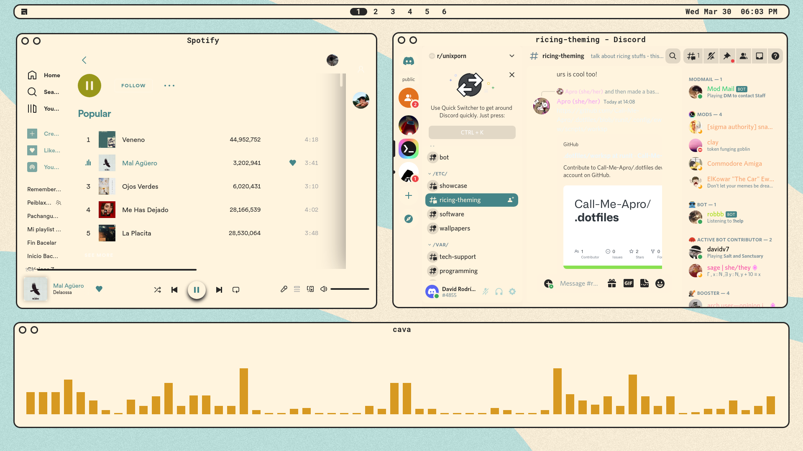

<div align="center"> <h1><strong>RETRO</strong></h1> </div>

<details open>
<summary><strong>&nbsp;O V E R V I E W &nbsp;👁️‍🗨️</strong></summary>

A desktop that brings you back to 90s, alongside all the features of modern software. Enjoy
a **beautifully customized awesome desktop** that catches your eyes.
</details>

# 

<details open>
<summary><strong>&nbsp;S C R E E N S H O T S &nbsp;📸</strong></summary>

* **Awesome Theme**

	

	
</details>

#

<details open>
<summary><strong>&nbsp;I N S T A L L A T I O N &nbsp;🛠</strong></summary>

### Arch Linux

* *Mandatory* dependencies:
	```console
	sudo pacman -S awesome rofi dunst picom pulseaudio feh brightnessctl playerctl flameshot
	```

* *Optional* dependencies:
	```console
	sudo pacman -S alacritty firefox bottom kitty
	```

	```console
	yay -S betterdiscord-installer spicetify-cli
	```

	**Note:** Some of these optional programs may need some configuration in order to work properly with provided patterns.


### Ubuntu
</details>

#

<details>
<summary><strong>&nbsp;D E T A I L S &nbsp;📝</strong></summary>

| Attribute                | Using                  |
| -------------------------| -----------------------|
| WM                       | awesome                |
| Terminal                 | alacritty              |
| Shell                    | zsh                    |
| Editor                   | vscode                 |
| Compositor               | picom                  |
| Launcher                 | rofi                   |
| Font                     | Robot Mono             |
| Default theme            | Awesome                |
</details>

#

<details>
<summary><strong>&nbsp;M A I N &nbsp; K E Y B I N D S &nbsp;#️⃣</strong></summary>

| Keybind                                 | Action                                                    |
|-----------------------------------------|-----------------------------------------------------------|
| <kbd>super + enter</kbd>                | Spawn terminal                                            |
| <kbd>super + ctrl + f</kbd>             | Spawn web browser                                         |
| <kbd>super + space</kbd>                | Launch applications launcher                              |
| <kbd>super + w</kbd>                    | Close window                                              |
| <kbd>super + {0-9}</kbd>                | Change workspace                                          |
| <kbd>super + ]</kbd>                    | Change to next workspace                                  |
| <kbd>super + [</kbd>                    | Change to previous workspace                              |
| <kbd>super + shift + {0-9}</kbd>        | Move focused window to workspace                          |
| <kbd>super + s</kbd>                    | Set floating/tiling layout                                |
| <kbd>super + z</kbd>                    | Open menu                                                 |
</details>

#

<details>
<summary><strong>&nbsp;D E P E N D E N C Y &nbsp;L I S T &nbsp;🔗</strong></summary>

* [awesome](https://github.com/svenstaro/rofi-calc)
* [picom (ibhagwan fork)](https://github.com/ibhagwan/picom)
* [rofi](https://github.com/davatorium/rofi)
* [pulseaudio](https://wiki.archlinux.org/title/PulseAudio)
* [feh](https://github.com/derf/feh)
* [brightnessctl](https://github.com/Hummer12007/brightnessctl)
* [playerctl](https://github.com/altdesktop/playerctl)
* [firefox](https://www.mozilla.org/en-US/firefox/new/)
* [flameshot](https://github.com/flameshot-org/flameshot)
* [alacritty (Optional)](https://github.com/alacritty/alacritty)
* [better-discord (Optional)](https://betterdiscord.app/)
* [spicetify (Optional)](https://spicetify.app/)
* [bottom (Optional)](https://github.com/ClementTsang/bottom)
</details>

#

<details>
<summary><strong>&nbsp;C R E D I T S &nbsp;👥</strong></summary>

* Desktop ported by [@daavidrgz](https://github.com/daavidrgz)
* Original author [@ChocolateBread799](https://github.com/ChocolateBread799)
</details>
