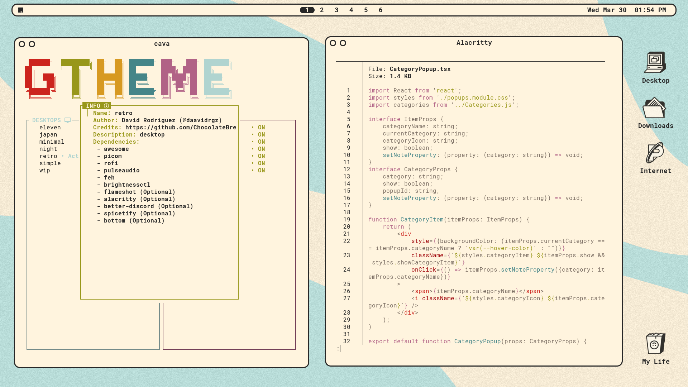

 <h1><strong>SIMPLE</strong></h1> 

### **‣ &nbsp;O V E R V I E W &nbsp;👁️‍🗨️**

A desktop that brings you back to 90s, but alongside all the features of modern software. Enjoy
a **beautilfully customized awesome desktop** that catch your eyes.

# 
### **‣ &nbsp;S C R E E N S H O T S &nbsp;📸**

* **Awesome Theme**

	

#

### **‣ &nbsp;D E T A I L S &nbsp;📝**

| Attribute                | Using                  |
| -------------------------| -----------------------|
| WM                       | awesome                |
| Terminal                 | alacritty              |
| Shell                    | zsh                    |
| Editor                   | vscode                 |
| Compositor               | picom                  |
| Launcher                 | rofi                   |
| Font                     | Robot Mono             |
| Default theme            | Awesome                |

#

### **‣ &nbsp;M A I N &nbsp; K E Y B I N D S &nbsp;#️⃣**

| Keybind                                 | Action                                                    |
|-----------------------------------------|-----------------------------------------------------------|
| <kbd>super + enter</kbd>                | Spawn terminal                                            |
| <kbd>super + ctrl + f</kbd>             | Spawn web browser                                         |
| <kbd>super + d</kbd>                    | Launch applications launcher                              |
| <kbd>super + w</kbd>                    | Close window                                              |
| <kbd>super + {0-9}</kbd>                | Change workspace                                          |
| <kbd>super + ]</kbd>                    | Change to next workspace                                  |
| <kbd>super + [</kbd>                    | Change to previous workspace                              |
| <kbd>super + shift + {0-9}</kbd>        | Move focused window to workspace                          |
| <kbd>super + s</kbd>                    | Set floating layout                                       |
| <kbd>super + t</kbd>                    | Set tiling layout                                         |

#

### **‣ &nbsp;D E P E N D E N C I E S &nbsp;🔗**
* [awesome](https://github.com/svenstaro/rofi-calc)
* [picom (ibhagwan fork)](https://github.com/ibhagwan/picom)
* [rofi](https://github.com/davatorium/rofi)
* [pulseaudio](https://wiki.archlinux.org/title/PulseAudio)
* [feh](https://github.com/derf/feh)
* [brightnessctl](https://github.com/Hummer12007/brightnessctl)
* [playerctl](https://github.com/altdesktop/playerctl)
* [flameshot](https://github.com/flameshot-org/flameshot)
* [alacritty (Optional)](https://github.com/alacritty/alacritty)
* [better-discord (Optional)](https://betterdiscord.app/)
* [spicetify (Optional)](https://spicetify.app/)
* [bottom (Optional)](https://github.com/ClementTsang/bottom)

#

### **‣ &nbsp;C R E D I T S &nbsp;👥**
* Desktop ported by [@daavidrgz](https://github.com/daavidrgz)
* Original author [@ChocolateBread799](https://github.com/ChocolateBread799)
