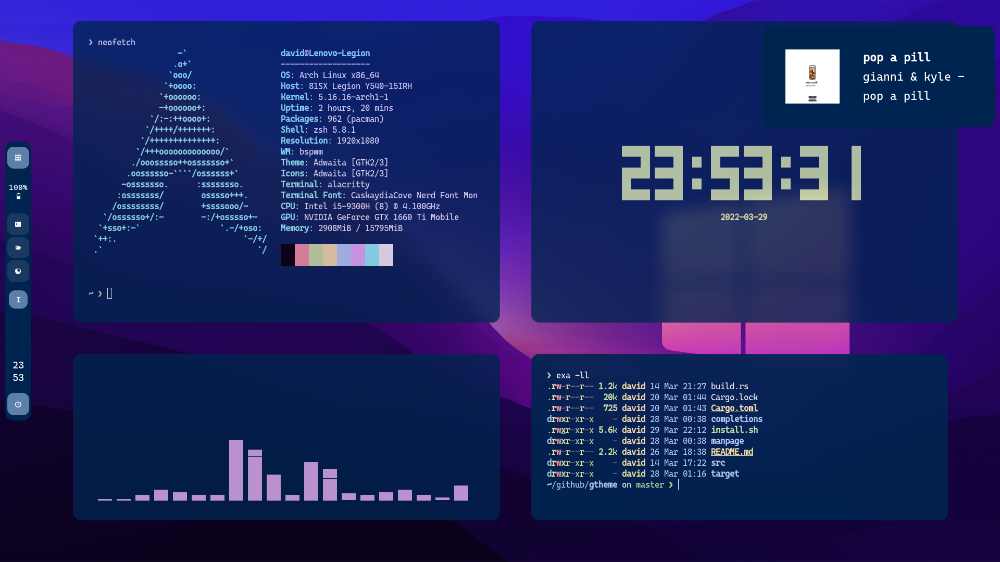
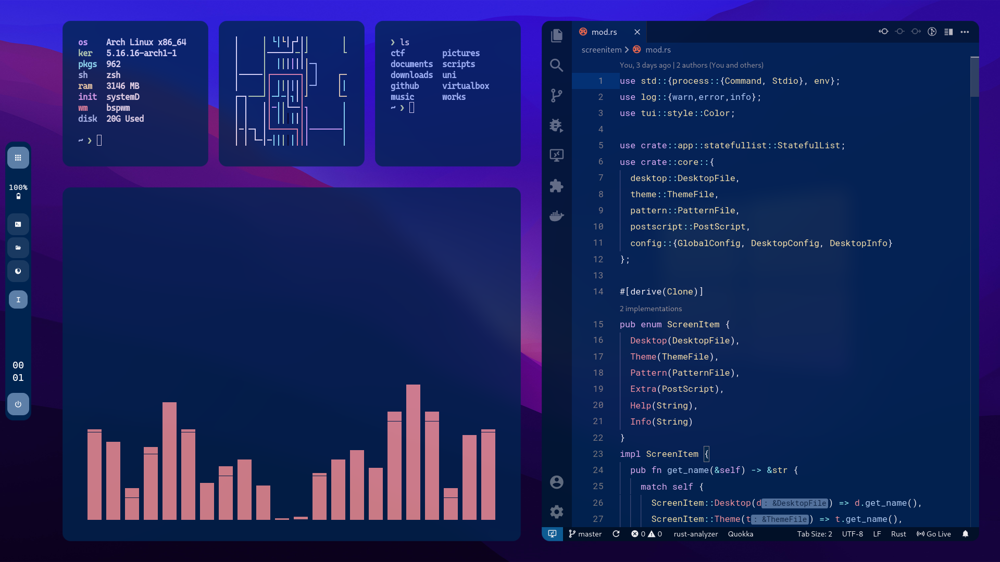
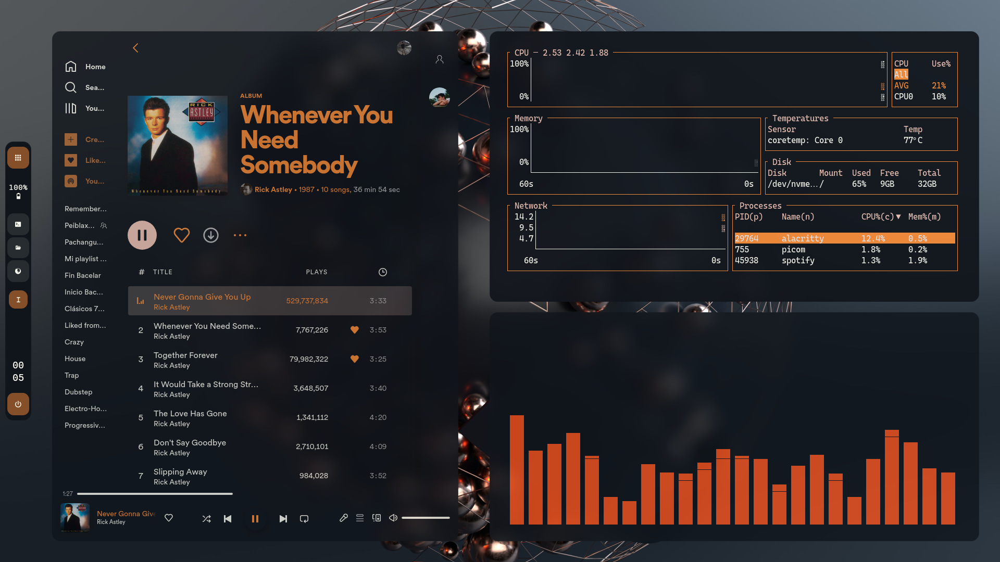
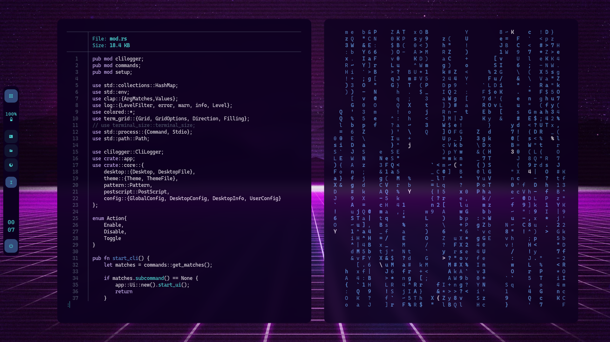

# WIP
A simple and minimalistic desktop with rounded corners and transparency.

### **‣ S C R E E N S H O T S &nbsp;📸**

* **Tomorrow-Night-Blue Theme**

	
	

* **Future Theme**

	

* **Nu-Disco Theme**

	

#

### **‣ D E T A I L S &nbsp;📝**

| Programs                 | Using                  |
| -------------------------| -----------------------|
| WM                       | bspwm                  |
| Terminal                 | alacritty              |
| Shell                    | zsh                    |
| Editor                   | vscode                 |
| Compositor               | picom                  |
| Notifications            | dunst                  |
| Launcher                 | rofi                   |
| Bar                      | tint2                  |
| Volume/Brightness        | xob                    |
| Font                     | Caskaydia Cove         |
| Default theme            | Tomorrow-Night-Blue    |

#

### **‣ M A I N &nbsp; K E Y B I N D S &nbsp;#️⃣**

| Keybind                                 | Action                                                    |
|-----------------------------------------|-----------------------------------------------------------|
| <kbd>super + enter</kbd>                | Spawn terminal                                            |
| <kbd>super + ctrl + f</kbd>             | Spawn web browser                                         |
| <kbd>super + d</kbd>                    | Launch applications launcher                              |
| <kbd>super + w</kbd>                    | Close window                                              |
| <kbd>super + {1-0}</kbd>                | Change workspace                                          |
| <kbd>super + ]</kbd>                    | Change to next workspace                                  |
| <kbd>super + [</kbd>                    | Change to previous workspace                              |
| <kbd>super + shift + {1-0}</kbd>        | Move focused window to workspace                          |
| <kbd>super + s</kbd>                    | Set floating layout                                       |
| <kbd>super + t</kbd>                    | Set tiling layout                                         |
| <kbd>alt + tab</kbd>                    | Window switcher                                           |

#

### **‣ D E P E N D E N C I E S &nbsp;🔗**
* [pulsectl (pip)](https://pypi.org/project/pulsectl/)            
* [bspwm](https://github.com/baskerville/bspwm)                     
* [sxhkd](https://github.com/baskerville/sxhkd)                     
* [picom (ibhagwan fork)](https://github.com/ibhagwan/picom)                     
* [rofi](https://github.com/davatorium/rofi)                     
* [dunst](https://github.com/dunst-project/dunst)                     
* [pulseaudio](https://wiki.archlinux.org/title/PulseAudio)                
* [pamixer](https://github.com/cdemoulins/pamixer)                   
* [feh](https://github.com/derf/feh)                       
* [brightnessctl](https://github.com/Hummer12007/brightnessctl)             
* [playerctl](https://github.com/altdesktop/playerctl)                 
* [xob](https://github.com/florentc/xob)                       
* [tint2](https://gitlab.com/o9000/tint2)                     
* [flameshot (Optional)](https://github.com/flameshot-org/flameshot)      
* [alacritty (Optional)](https://github.com/alacritty/alacritty)      
* [better-discord (Optional)](https://betterdiscord.app/)
* [spicetify (Optional)](https://spicetify.app/)      
* [bottom (Optional)](https://github.com/ClementTsang/bottom)         
